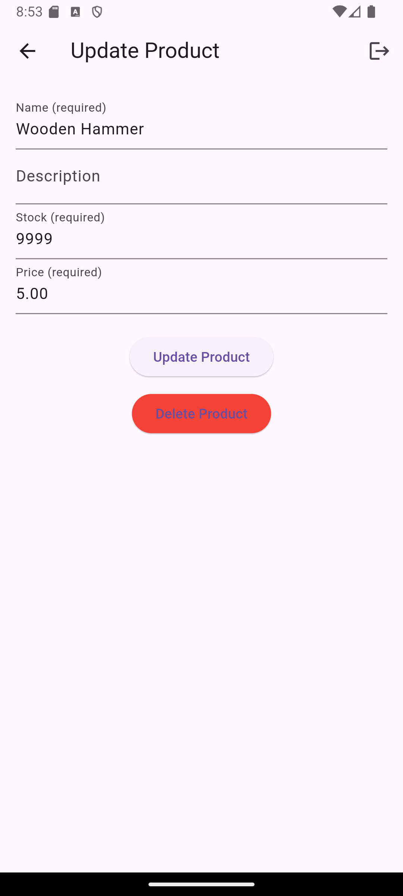
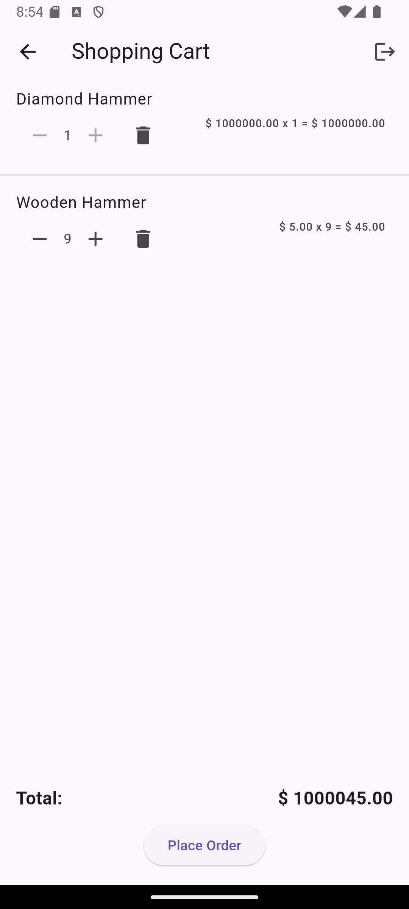

# Amplify Flutter Demo Shopping App

A Flutter shopping application demonstrating the integration of AWS Amplify services for backend functionality.

## Screenshots

Account creation with email verification


Product listing with real-time updates


Product details


Product update



Shopping cart (in-memory)



## Data Model

The application uses AWS AppSync GraphQL API with the following schema ([file](amplify/backend/api/demoshoppingapp/schema.graphql)):

```graphql
type Product @model @auth(rules: [
  { allow: owner },
  { allow: public, operations: [read] }
]) {
  id: ID!
  name: String!
  description: String
  stock: Int!
  price: Float!
}
```

The schema defines a Product model with:

- Authentication rules allowing owners full access and public read-only access
- Required fields: id, name, stock, and price
- Optional field: description

## AWS Services Used

1. **AWS AppSync**
   - Provides GraphQL API for product management
   - Handles real-time data synchronization

2. **Amazon Cognito**
   - User authentication and authorization
   - Manages user sessions and tokens

3. **AWS Amplify Gen 1**
   - Backend infrastructure management
   - API integration and configuration

## Project Structure

### `/lib` Directory Organization

- `/config`: Configuration files and constants
- `/models`: Generated GraphQL model classes
- `/pages`: Flutter UI screens and widgets
- `/router`: Application routing configuration
- `/services`: Business logic and API service layers

### Key Features

1. **Authentication**
   - User sign-up and sign-in using Amplify Authenticator
   - Protected routes and authenticated API calls

2. **Product Management**
   - Create, read, update, and delete products
   - Product listing with real-time updates
   - Stock and price management

3. **Routing**
   - Declarative routing using GoRouter
   - Protected route handling

## Getting Started

1. Install dependencies:

   ```bash
   flutter pub get
   ```

2. Configure Amplify:

   ```bash
   amplify init
   amplify push
   ```

3. Run the application:

   ```bash
   flutter run
   ```

Make sure you have the AWS Amplify CLI and Flutter installed on your development machine.
